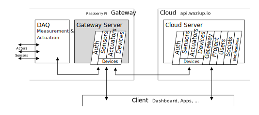

# Wazihub Gateway

The Wazihub Gateway is a tiny server between your measurement & actuation software
and the Wazihub Cloud, running on the Raspberry Pi. It has a easy-to-use API for
REST and MQTT and will manage your measurement data, incomming actuation commands
and synchronization with the [Wazihub Cloud](https://wazihub.com/).


# API

The Gateway Server uses the same API as the Cloud Server. See [Cloud Server API](http://api.staging.waziup.io/docs). This is so that you have consistency between Cloud and Gateway and can connect with the dashboard to either one of them.

For example, open [`/devices`](http://api.staging.waziup.io/docs/#/Devices/get_devices) in your browser to see all devices with their sensors and actuators.

However, the Gateway API is just a light version of the Cloud API and does not cover all Cloud API endpoints. For now, you can only use `/devices` and `/auth` but we will extend the API soon :)

## REST and MQTT

All API endpoints can be used with REST (HTTP POST, GET and PUT requests) and with MQTT.

**REST** is a request response protocol, so use it whenever you want to access a single endpoint.

*Use it to*
- query endpoints (Get),
- update single endpoints (Post, Put).

```
Query all devices:

GET devices
  Open the url in your browser to see a list of all devices.

With JavaScript:
  fetch("devices")
```

```
Get a single sensor value:

GET devices/device123/sensors/temperature1/value
  Open the url in your browser to see the last value of the 'temperature1' sensor from the 'device123' device.

With JavaScript:
  fetch("devices/device123/sensors/temperature1/value")
```

```
Set a new actuator value:

POST devices/device123/actuators/led1/value
  with HTTP body content: "true"

  The actuator 'led1' will recieve the command 'true' and act accordingly (the LED will turn on).

With JavaScript:
  fetch("devices/device123/actuators/led1/value", {method: "POST", body: "true"})
```

**MQTT** is a publish subscriber protocol. You can use it for sending multiple values in a row (which is better done with MQTT than with multiple REST requests because MQTT will use just a single network connection!).

*Use it to*
- update one or more endpoints (Publish),
- subscribe to endpoints and recieve notifications (Subscribe).

A good MQTT client is the [HiveMQ MQTT Client](http://hivemq.com/demos/websocket-client/) with MQTT over WebSocket. Connect to your Gateway or the Cloud and push values using 'Publish' with the 'topic' set to the endpoint.


```
Update sensor values:

Publish devices/device123/sensors/temperature1/value
  Change the 'temperature1' sensor value.
  You can also use REST (POST requests) but should stay with MQTT if you intend to set the value more than once.
```

With MQTT you can also subscribe to endpoints and get notified when the endpoint changes due to POST (with REST) and Publish calls (with MQTT).

```
Subscribe devices/device123/sensors/temperature1/value
  to be notified of any changes to the 'temperature1' sensor.

Subscribe devices/device123/sensors/*/value
  to be notified of any changes to any of the device's sensors.

Subscribe devices/device123/#
  to be notified of any changes of this device: actuation, sensors and device specific settings.
```

# Your DAQ

DAQ (data acquisition) is your tool that does the actual measurements and manages the actuators, that is, communicate with hardware sensors.

You can use [Congduc Pham: Low Cost LoRa Gateway](https://github.com/CongducPham/LowCostLoRaGw) (see [github.com/CongducPham](https://github.com/CongducPham)) or have a look at my [Wazihub Raspberry Pi Demo](https://github.com/j-forster/Wazihub-Demo-RaspberryPi).

Your DAQ tool should communicate with the local Gateway Server that is runnig together with you DAQ on the Raspberry Pi.

There are three things your DAQ should do when it starts up:
1. **Declare** all your sensors and actuators to the Gateway Server with `Post /devices` (REST).
2. Do your measurements and **Publish** all sensor values to `/devices/../sensors/../value` (MQTT).
3. Wait for actuation commands with **Subscribe** to `/devices/../actuators/../value` (MQTT).

You should not directly communicate with the Cloud Server! Just use the local Gateway Server and let it manage all remote communication and synchronization.

# Synchonization

The Gateway Server will automatically connect to the Cloud Server when there is a network connection available. MQTT can cache all non-synchronized data (all Post, Put and Publish calls) if there is no network available. This is done by an automatic MQTT Subscription from the Cloud Server to the Gateway Server.

Actuation commands (values) are transfered between Cloud and Gateway by an automatic Subscription from the Gateway to its remote _actuator_ endpoints.

# Login (Authorization)

**REST**

1. Call [`POST /auth/token`](http://api.staging.waziup.io/docs/#/Auth/post_auth_token) with your credentials (username and password) to get a auth-token.
2. Use the auth token with every API call as request header [`Authorization: Bearer {token}`](https://developer.mozilla.org/en-US/docs/Web/HTTP/Headers/Authorization).

**MQTT**

When logging in with MQTT, use your username and password.
All following MQTT Publish & Subscribe calls within this MQTT session are authorized now.
